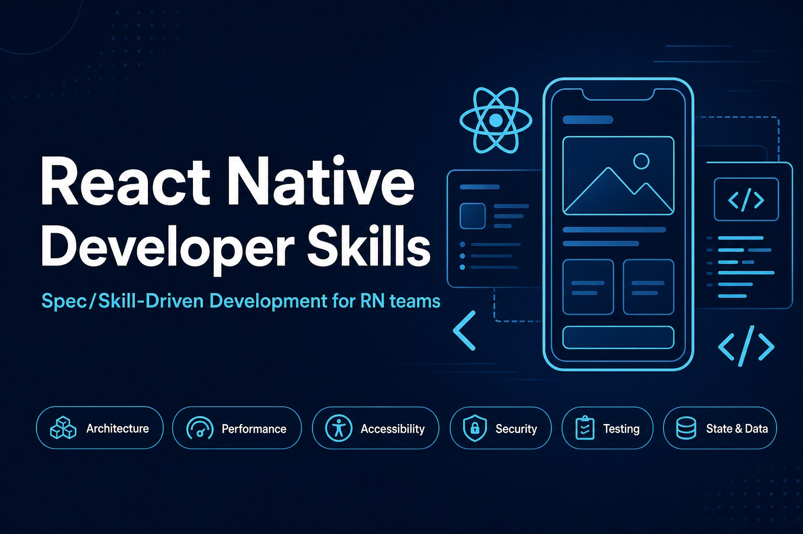

# React Native Developer Skills



Vendor-neutral React Native skills for **developers and AI agents**. Practise **Spec/Skill-Driven Development (SSD)** — from spec to review — with focused Markdown guides you can drop into any RN project.

Each skill is a self-contained guide with a clear "when to use", a checklist, correct/incorrect examples, and pitfalls.

## What is Spec/Skill-Driven Development?

Instead of jumping straight to code, you:

1. **Spec it** — capture requirements, then design, then tasks (see the `spec-authoring` skill).
2. **Build it** — implement, using the focused skills (architecture, performance, state, etc.) as guidance.
3. **Review it** — audit the result with the `code-review` skill, which routes each concern to its focused skill.

The same skills inform all three stages: what guides the build also defines the review criteria.

## Skill Index

### Plan
| Skill | Description |
|---|---|
| [spec-authoring](skills/spec-authoring/SKILL.md) | Write a spec before building — requirements, design, and tasks in order, with traceability between them. |

### Build & review (focused areas)
| Skill | Description |
|---|---|
| [architecture](skills/architecture/SKILL.md) | Folder structure, navigation, deep linking, rendering safety, error boundaries, and code quality. |
| [performance](skills/performance/SKILL.md) | Re-renders, list virtualisation, images, animations, and memory/resource cleanup. |
| [accessibility](skills/accessibility/SKILL.md) | Labels, roles, touch targets, focus order, colour, and dynamic type. |
| [state-and-data](skills/state-and-data/SKILL.md) | Server state, caching, offline behaviour, network transitions, transactions, and loading/empty/error states. |
| [security](skills/security/SKILL.md) | Secrets, secure storage, transport security, PII in logs, deep-link validation, and privacy compliance. |
| [testing](skills/testing/SKILL.md) | Unit, component, and E2E coverage; edge cases; and test quality. |

### Baseline (apply to every change)
| Skill | Description |
|---|---|
| [critical-rules](skills/critical-rules/SKILL.md) | Non-negotiable rules that prevent crashes, data loss, security breaches, and compliance violations. |
| [conventions](skills/conventions/SKILL.md) | Project conventions for structure, TypeScript, naming, file size, and hygiene. |

### Audit
| Skill | Description |
|---|---|
| [code-review](skills/code-review/SKILL.md) | Entry point that routes each concern to its focused skill and defines the review output format. |

## Installation

### Codex and Claude

For broad agent support, use the standard skills CLI:

```bash
npx skills add Neha/rn-developer-skills
```

The scripts below are a zero-dependency fallback when you want local setup without manually copying the `skills/` folder.

**macOS / Linux**

```bash
chmod +x scripts/install.sh
./scripts/install.sh all
```

**Windows**

```powershell
.\scripts\install.ps1 all
```

Or from `cmd.exe`:

```bat
scripts\install.cmd all
```

Install only one target when needed:

```bash
./scripts/install.sh codex
./scripts/install.sh claude
```

The Codex installer copies each skill folder to `$HOME/.agents/skills`, which current Codex docs list as the user-level skills directory. Override with `--codex-dir` or `CODEX_SKILLS_DIR` if your Codex setup uses a different location.

The Claude installer copies each skill folder to `$HOME/.claude/skills` and also writes uploadable ZIP files to `dist/claude/`. Override the local copy location with `--claude-dir` or `CLAUDE_SKILLS_DIR` if your Claude setup expects a different skills directory. For Claude.ai, upload the generated ZIP files from **Customize → Skills**.

By default, existing installed skill folders are left untouched. Add `--force` on macOS/Linux or `-Force` on Windows to replace them.

### Cursor (recommended)

Requires **Cursor 3.9+** (Plugins and the **Customize** page). This repository is packaged as a [Cursor plugin](https://cursor.com/docs/plugins) for one-click install from the marketplace.

**From the Cursor Marketplace** *(after listing approval)*

1. Open the **Agents** view.
2. Click **Customize** in the left sidebar.
3. Open the **Plugins** tab, search for **React Native Developer Skills**, and click **Install**.

Shortcut: `Cmd+Shift+P` → **Cursor: Open Plugin Marketplace**

**Test locally before submission**

1. Clone this repo and load it as a local plugin:

   ```bash
   git clone https://github.com/Neha/rn-developer-skills.git
   ln -s "$(pwd)/rn-developer-skills" ~/.cursor/plugins/local/rn-developer-skills
   ```

2. Reload Cursor: `Cmd+Shift+P` → **Developer: Reload Window**
3. Open **Customize → Skills** and confirm all 10 skills appear.
4. Invoke a skill in chat, e.g. `/spec-authoring` or `/code-review`.

**Team Marketplace** *(Cursor Teams/Enterprise)*

Admins import the repo under **Dashboard → Settings → Plugins → Team Marketplaces → Add Marketplace → Import from Repo**, then assign it to a distribution group.

To submit this plugin for public listing, see [cursor.com/marketplace/publish](https://cursor.com/marketplace/publish).

### Manual / other tools

These skills are plain Markdown, so you can adopt them in whichever way suits your workflow:

1. **Clone or copy** this repository (or just the `skills/` folder) into your project, for example under `.cursor/skills/`, `.kiro/`, or a `docs/` directory.
2. **Point your agent or team at them.** If you use an AI development tool that supports skills, place `skills/` where the tool expects them.
3. **Reference a skill when you work.** Open the relevant `SKILL.md` (or ask your agent to apply it) when planning, building, or reviewing.
4. **Run validation** (optional) to keep contributions consistent:
   ```bash
   node scripts/validate-skills.mjs
   ```
   Validates skill frontmatter, README index coverage, and `.cursor-plugin/plugin.json` against the Cursor schema.

## Using a Skill

Each `SKILL.md` follows the same shape, so any skill is predictable to navigate:

- **When to Use** — the situations the skill applies to.
- **Guidance** — checklists and explanations, with correct/incorrect examples.
- **Anti-Patterns** *(where useful)* — a table of common mistakes and their fixes.
- **Pitfalls** — subtle gotchas the checklist alone does not catch.

Start with `spec-authoring` for a new feature, reach for the focused skills while building, and finish with `code-review`.

## Repository Layout

```
.cursor-plugin/   Cursor marketplace manifest (plugin.json)
docs/             contributor guides (skill authoring walkthrough)
schemas/          JSON Schema for plugin manifest validation
skills/            one folder per skill, each with a SKILL.md
templates/         starting points for new skills and specs
scripts/           validation tooling
assets/            logo and announcement image
```

## Contributing

See [CONTRIBUTING.md](CONTRIBUTING.md) for how to propose a new skill or edit an existing one, including the required `SKILL.md` structure and frontmatter. New skills should pass `node scripts/validate-skills.mjs` and be added to the Skill Index above.

## License

[MIT](LICENSE)
